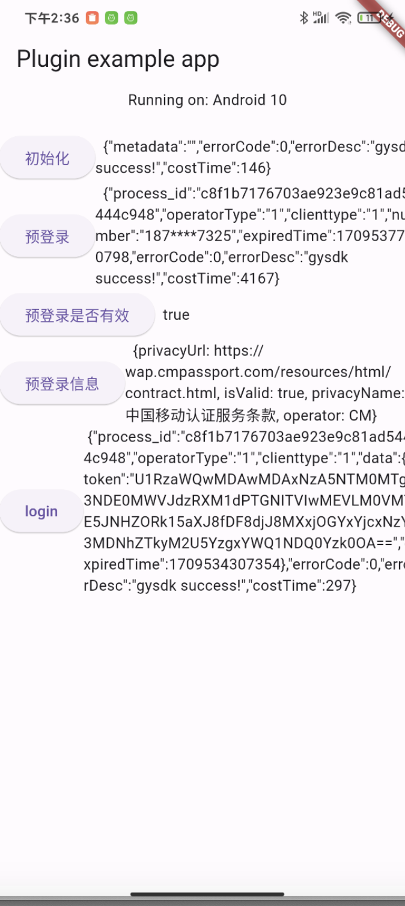
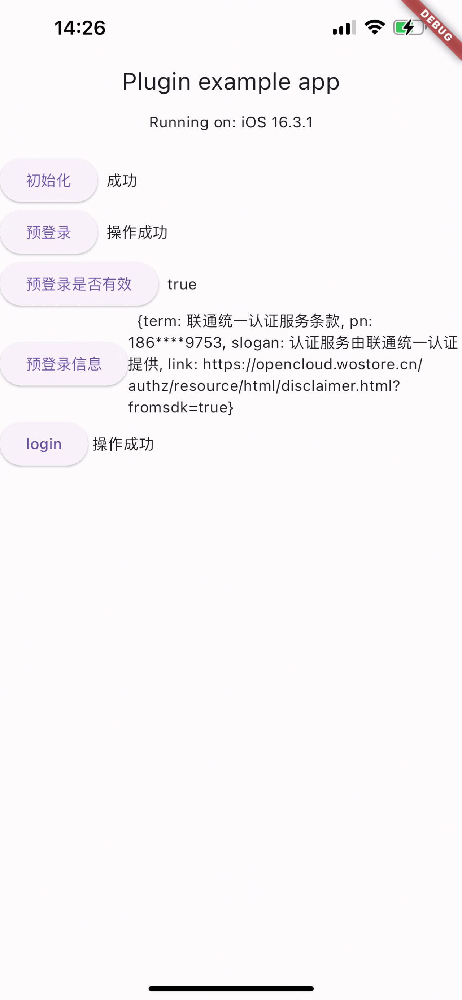

# 1、引用

Pub.dev: https://pub.dev/packages/gyflut

增加依赖：
`flutter pub add gyflut`

或者手动在工程 pubspec.yaml 中加入 dependencies：

```yaml
dependencies:
  gyflut: ^0.0.6
```


下载依赖：

```yaml
flutter pub get
flutter run
```


# 2、配置

## 2.1 Android配置

##### 2.1.1 app的build.gradle配置

到个推官网申请appID、配置签名文件

```groovy
defaultConfig {
        applicationId "自己填"
        //.......
        manifestPlaceholders = [
                GETUI_APPID         : "自己填",//请填写开发者在 https://dev.getui.com/ 申请的GETUI_APPID
                GT_INSTALL_CHANNEL: "getui",//请填写开发者需要的channel
        ]
    }
```

```groovy
signingConfigs {
        myConfig {
            storeFile file("自己填")//请换成开发者自己的签名配置
            keyAlias '自己填'
            keyPassword '自己填'
            storeFile file('../自己填')
            storePassword '自己填'
        }
    }

    buildTypes {
        debug {
            minifyEnabled false
            signingConfig signingConfigs.myConfig
            proguardFiles getDefaultProguardFile('proguard-android.txt'), 'proguard-rules.pro'
        }
        //..........
        }
```

配置依赖，最新版本见官网： https://docs.getui.com/geyan/mobile/android/init/

```groovy
dependencies {
    //-----集成个验SDK-----
    // 个推基础库
    implementation 'com.getui:gtc:3.2.1.0'
    // 个验sdk
    implementation 'com.getui:gysdk:3.1.0.0'
}
```


##### 2.1.2 project的build.gradle配置

```groovy
allprojects {
    repositories {
        maven {
           //仓库配置
            url "https://mvn.getui.com/nexus/content/repositories/releases/"
        }
       //....
    }
}
```
## 2.2 IOS配置
在你项目的main.dart中添加下列代码：
```dart
/// preLoginUseCache:预登录是否使用缓存，默认为true
/// debug:是否开启SDK的debug模式，默认false
/// operatorDebug:是否开启运营商的debug模式，默认false
/// appId: appid（ios)
/// preLoginTimeout: 预登录超时时长（ios)
/// eloginTimeout:登录超时时长（ios)
 Gyflut().initGySdk(true, true, false, "5xpxEg5qvI9PNGH2kQAia2");
```


#  3、使用

```dart
import 'package:gyflut/gyflut.dart';
```

## 3.1 API

```dart
/**
* 初始化
* preLoginUseCache:预登录是否使用缓存，默认为true
* debug:是否开启SDK的debug模式，默认false
* operatorDebug:是否开启运营商的debug模式，默认false
* appId: appid（ios)
* preLoginTimeout: 预登录超时时长（ios)
* eloginTimeout:登录超时时长（ios)
*/
Gyflut().initGySdk( true, true, false, "5xpxEg5qvI9PNGH2kQAia2");


//预登录
 Gyflut().ePreLogin();

//预登录是否有效
 bool? isPreLoginResultValid = await Gyflut().isPreLoginResultValid();

//预登录信息
Map<dynamic, dynamic>? getPreLoginResult = await Gyflut().getPreLoginResult();

//登录
Gyflut().login();
```


### 3.2 Android demo

https://github.com/GetuiLaboratory/getui-flutter-plugin/tree/master/example




### 3.2 IOS demo

https://github.com/GetuiLaboratory/getui-flutter-plugin/tree/master/example

