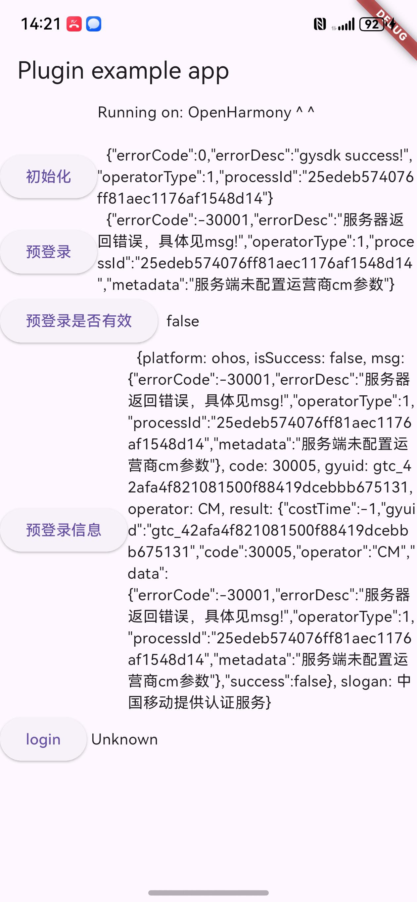

# 1、引用

Pub.dev: https://pub.dev/packages/gyflut

增加依赖：
`flutter pub add gyflut`

或者手动在工程 pubspec.yaml 中加入 dependencies：

```yaml
dependencies:
  gyflut: ^0.0.8
```


下载依赖：

```yaml
flutter pub get
flutter run
```


# 2、配置

## 2.1 Android配置

##### 2.1.1 app的build.gradle配置

到个推官网申请appID、配置签名文件

```groovy
defaultConfig {
        applicationId "自己填"
        //.......
        manifestPlaceholders = [
                GETUI_APPID         : "自己填",//请填写开发者在 https://dev.getui.com/ 申请的GETUI_APPID
                GT_INSTALL_CHANNEL: "getui",//请填写开发者需要的channel
        ]
    }
```

```groovy
signingConfigs {
        myConfig {
            storeFile file("自己填")//请换成开发者自己的签名配置
            keyAlias '自己填'
            keyPassword '自己填'
            storeFile file('../自己填')
            storePassword '自己填'
        }
    }

    buildTypes {
        debug {
            minifyEnabled false
            signingConfig signingConfigs.myConfig
            proguardFiles getDefaultProguardFile('proguard-android.txt'), 'proguard-rules.pro'
        }
        //..........
        }
```

配置依赖，最新版本见官网： https://docs.getui.com/geyan/mobile/android/init/

```groovy
dependencies {
    //-----集成个验SDK-----
    //一键认证sdk
    implementation 'com.getui:gysdk:3.2.0.0'
    //个推公共库，如已接其他个推sdk则保留一个最高版本即可
    implementation 'com.getui:gtc:3.2.18.0'
}
```


##### 2.1.2 project的build.gradle配置

```groovy
allprojects {
    repositories {
        maven {
           //仓库配置
            url "https://mvn.getui.com/nexus/content/repositories/releases/"
        }
       //....
    }
}
```
## 2.2 IOS配置
在你项目的main.dart中添加下列代码：
```dart
/// preLoginUseCache:预登录是否使用缓存，默认为true
/// debug:是否开启SDK的debug模式，默认false
/// operatorDebug:是否开启运营商的debug模式，默认false
/// appId: appid（ios)
/// preLoginTimeout: 预登录超时时长（ios)
/// eloginTimeout:登录超时时长（ios)
 Gyflut().initGySdk(true, true, false, "5xpxEg5qvI9PNGH2kQAia2");
```


## 2.3 ohos配置
*  引入插件, 见上文
* 使用鸿蒙定制版 Flutter，否则报错依赖缺失, 下载地址: [OpenHarmony Flutter](https://gitcode.com/openharmony-tpc/flutter_flutter) 及 [使用教程](https://developer.huawei.com/consumer/cn/blog/topic/03178381351651116)。
* [启动应用教程](https://gitcode.com/openharmony-tpc/flutter_flutter#%E6%9E%84%E5%BB%BA%E6%AD%A5%E9%AA%A4)

### 2.3.1 build-profile.json5配置
 ohos工程兼容字节码包、配置正确的签名信息,在项目级build-profile.json5:
```yaml
    "products": [
      {
        "name": "default",
        "signingConfig": "签名信息",
        "compatibleSdkVersion": "5.0.0(12)",
        "runtimeOS": "HarmonyOS",
        "buildOption": {
          "strictMode": {
            "useNormalizedOHMUrl": true
          }
        }
      }
    ],
```
### 2.3.2 ohos UI配置
ohos需要原生UI的配置项,参考[demo](https://github.com/GetuiLaboratory/getui-gysdk-flutter/tree/main/example/ohos)中Index.ets 和 EntryAbility.ets

```dart
//--------------entryAbility类-------------------
 private  static  entryAbility :EntryAbility|null

  onCreate(want: Want, launchParam: AbilityConstant.LaunchParam): void {
    EntryAbility.entryAbility = this
    super.onCreate(want, launchParam)
  }

    public  static  getInstanse(): EntryAbility|null {
       return EntryAbility.entryAbility
    }

    onDestroy(): void {
      super.onDestroy()
      EntryAbility.entryAbility = null
    }
//----------------Index类-----------------
private readonly  dialogController: CustomDialogController //省略 ......

aboutToAppear(): void {
//使用弹框模式
//this.config.setWindowMode(this.dialogController)
//this.config.setLogoMargin({ top: 50 })

let  plugin : GysdkFlutterPlugin =   EntryAbility.getInstanse()?.getFlutterEngine()?.getPlugins()?.get(new GysdkFlutterPlugin().getUniqueClassName()) as GysdkFlutterPlugin
plugin.config = this.config
}

```

### 2.3.3 配置 `module.json5`
在项目中配置：
```yaml
    "requestPermissions": [
      {"name" :  "ohos.permission.INTERNET"},
    ],
    "metadata": [
      {
        "name": "GETUI_APPID",
        "value": '你的appid',
      },
      {
        "name": "GT_INSTALL_CHANNEL",
        "value": 'CHANNEL'
      }]
}
```

### 2.3.4 插件注册
运行 fvm flutter build hap 后自动生成 GeneratedPluginRegistrant

#  3、使用

```dart
import 'package:gyflut/gyflut.dart';
```

## 3.1 API

```dart
/**
* 初始化
* preLoginUseCache:预登录是否使用缓存，默认为true
* debug:是否开启SDK的debug模式，默认false
* operatorDebug:是否开启运营商的debug模式，默认false
* appId: appid（ios)
* preLoginTimeout: 预登录超时时长（ios)
* eloginTimeout:登录超时时长（ios)
*/
Gyflut().initGySdk( true, true, false, "5xpxEg5qvI9PNGH2kQAia2");


//预登录
 Gyflut().ePreLogin();

//预登录是否有效
 bool? isPreLoginResultValid = await Gyflut().isPreLoginResultValid();

//预登录信息
Map<dynamic, dynamic>? getPreLoginResult = await Gyflut().getPreLoginResult();

//登录
Gyflut().login();

//关闭弹框(仅ohos)
Gyflut().closeAuthLoginPage()
```


### 3.2 Android demo

https://github.com/GetuiLaboratory/getui-gysdk-flutter/tree/main/example/android


### 3.3 IOS demo
https://github.com/GetuiLaboratory/getui-gysdk-flutter/tree/main/example/ios


### 3.4 ohos demo

https://github.com/GetuiLaboratory/getui-gysdk-flutter/tree/main/example/ohos

